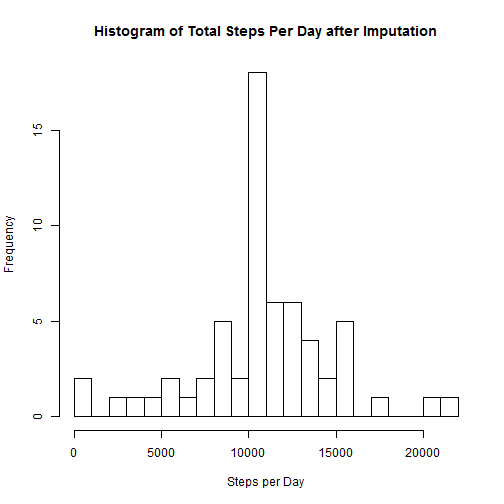

# Reproducible Research: Peer Assessment 1

This assignment makes use of data from a personal activity monitoring
device. This device collects data at 5 minute intervals through out the
day. The data consists of two months of data from an anonymous
individual collected during the months of October and November, 2012
and include the number of steps taken in 5 minute intervals each day.

The original source of this data is:

* Dataset: [Activity monitoring data](https://d396qusza40orc.cloudfront.net/repdata%2Fdata%2Factivity.zip) [52K]

The variables included in this dataset are:

* **steps**: Number of steps taking in a 5-minute interval (missing
    values are coded as `NA`)

* **date**: The date on which the measurement was taken in YYYY-MM-DD
    format

* **interval**: Identifier for the 5-minute interval in which
    measurement was taken

The dataset is stored in a comma-separated-value (CSV) file and there
are a total of 17,568 observations in this
dataset.


```r
library(knitr)
opts_knit$set(fig.keep = "high", fig.path = "figures/", dev = "png", warning = FALSE, 
    message = FALSE)
```


## Loading and preprocessing the data

Load the dataset from the zip file and convert the string dates to R date-time format.  
Also create totals of steps by day and average of steps by interval.


```r
activity <- read.csv(unz(description = "activity.zip", filename = "activity.csv"), 
    stringsAsFactors = FALSE)

# Convert string dates to R calendar dates It may be worthwhile to combine
# dates with interval to include time as well
activity$date <- strptime(activity$date, format = "%Y-%m-%d")

# Ignoring NAs for day totals.  Note this returns NA if ANY interval for a
# date is NA.
library(plyr)
activityByDay <- ddply(activity, .(date), function(x) sum(x$steps))
colnames(activityByDay)[2] <- "steps"

activityByInterval <- ddply(activity, .(interval), function(x) mean(x$steps, 
    na.rm = TRUE))
colnames(activityByInterval)[2] <- "avgSteps"
```

  

## What is mean total number of steps taken per day?

Missing values in the dataset are ignored here (as instructed).  Note there is some subtlety as to what this means.


```r
hist(activityByDay$steps, xlab = "Steps per Day", main = "Histogram of Total Steps Per Day", 
    breaks = 25)
```

 


Mean number of steps per day = 1.0766 &times; 10<sup>4</sup>  
Median number of steps per day = 10765  


## What is the average daily activity pattern?


```r
plot(activityByInterval$interval, activityByInterval$avgSteps, type = "l", xlab = "Interval", 
    ylab = "Average Number of Steps", main = "Average Number of Steps by Time of Day")
```

 

```r

avgStepOrder <- order(activityByInterval$avgSteps, decreasing = TRUE)
```


The maximum average number of steps per day is 206.1698 for time interval 835

## Imputing missing values

First check characteristics of missing values.


```r
M <- sapply(activity, function(x) sum(is.na(x)))
M[M > 0]
```

```
## steps 
##  2304
```

```r
table(as.factor(as.character(activity[is.na(activity$steps), "date"])))
```

```
## 
## 2012-10-01 2012-10-08 2012-11-01 2012-11-04 2012-11-09 2012-11-10 
##        288        288        288        288        288        288 
## 2012-11-14 2012-11-30 
##        288        288
```


The total number of missing values is 2304

Because the NAs occur in entire day blocks impute with the average for the interval.   


```r
# Having trouble getting this to work correctly, so just use brute force
# (slow!)
activityImp <- activity
for (i in seq(1, nrow(activityImp))) {
    if (is.na(activityImp$steps[i])) {
        activityImp$steps[i] <- activityByInterval[activityByInterval$interval == 
            activityImp$interval[i], "avgSteps"]
    }
}

# Compute daily totals after imputation
activityImpByDay <- ddply(activityImp, .(date), function(x) sum(x$steps))
colnames(activityImpByDay)[2] <- "steps"

hist(activityImpByDay$steps, xlab = "Steps per Day", main = "Histogram of Total Steps Per Day after Imputation", 
    breaks = 25)
```

 


Mean number of steps per day = 1.0766 &times; 10<sup>4</sup> after imputation.  
Median number of steps per day = 1.0766 &times; 10<sup>4</sup> after imputation.

The mean and median values are similar to those before imputation.  This is not surprising given that the imputation method chosen results in adding 8 days at the average.

## Are there differences in activity patterns between weekdays and weekends?

Create a factor to indicate whether a weekday or a weekend then compare the average number of steps by time.


```r
activityImp$weekday <- factor(weekdays(activityImp$date) %in% c("Saturday", 
    "Sunday"), labels = c("weekday", "weekend"))
activityImpByWdayInterval <- ddply(activityImp, .(weekday, interval), function(x) mean(x$steps))
colnames(activityImpByWdayInterval)[3] <- "avgSteps"

library(lattice)
xyplot(avgSteps ~ interval | weekday, data = activityImpByWdayInterval, type = "l", 
    layout = c(1, 2), xlab = "Interval", ylab = "Average Number of Steps", main = "Average Number of Steps by Time of Day")
```

 


There does appear to be a difference in activity patterns.  On weekdays steps are more concentrated in the morning and evening while on weekends steps are decreased in the early morning and more spread out across the remainder of the day.
